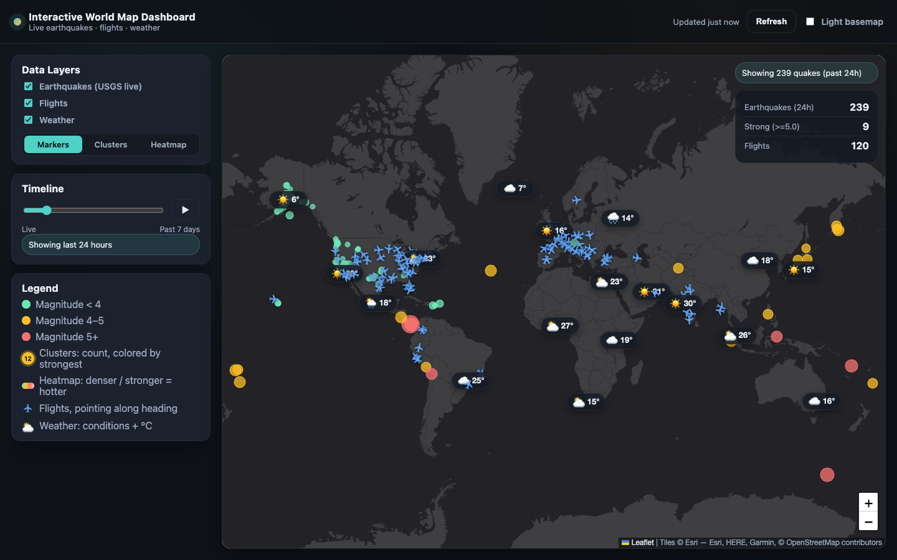

# Interactive World Map Dashboard

A live, dark-themed world map that brings together real-time earthquakes, flights, and weather in one view. Built with Leaflet and a small Flask proxy, plus a SwiftUI shell for iOS.



## Features
- **Earthquakes (USGS)**: the past week of quakes, colored and sized by magnitude. Switch between individual markers, clusters (colored by the strongest quake inside), or a heatmap.
- **Timeline**: filter from the last 6 hours to the past 7 days, or press play to step through it. Stats update with the selected window.
- **Flights (OpenSky)**: live aircraft positions, with planes rotated to their heading and altitude/speed in the popup.
- **Weather**: current conditions and temperature for 18 cities worldwide (Open-Meteo, or OpenWeather if you have a key).
- **Live updates**: auto-refreshes every 5 minutes and shows when data was last updated.
- **iOS app**: SwiftUI `WKWebView` wrapper with pull-to-refresh and a loading spinner.

## Tech stack
Leaflet 1.9 (markercluster, heat) · vanilla JS/CSS · Python + Flask · SwiftUI

## Quick start
```bash
python3 -m venv .venv && source .venv/bin/activate
pip install -r requirements.txt
python server.py
```
Then open http://localhost:5050.

### Optional environment variables
| Variable | Purpose |
| --- | --- |
| `OPENSKY_USER`, `OPENSKY_PASS` | OpenSky credentials for higher flight rate limits |
| `OPENWEATHER_API_KEY` | Use OpenWeather instead of the keyless Open-Meteo |
| `PORT` | Server port (default `5050`; macOS uses 5000 for AirPlay) |
| `HOST` | Bind address (default `127.0.0.1`; use `0.0.0.0` to reach it from other devices) |
| `FLASK_DEBUG=1` | Enable auto-reload while developing |


## How it works
The browser never talks to the data providers directly. `server.py` proxies USGS, OpenSky, and Open-Meteo/OpenWeather so API keys stay on the server, normalizes the responses, and caches them briefly (1–10 minutes) to stay within rate limits. Only the `public/` folder is served as static files.

```
public/
  index.html      layout and controls
  styles.css      dark theme, responsive layout
  app.js          map, layers, timeline, refresh logic
  vendor/leaflet/ vendored Leaflet + plugins (works offline)
server.py         Flask API proxy + static server
ios/              SwiftUI WKWebView app
```

## iOS app
1. Start the server (`python server.py`).
2. Open `ios/WorldMapDashboard.xcodeproj` in Xcode and run on a simulator.

The app loads `http://127.0.0.1:5050`. To run on a physical iPhone, start the server with `HOST=0.0.0.0` and change the URL in `ContentView.swift` to your Mac's local IP address.

## Roadmap
- Remember layer and timeline choices between visits.
- Native MapKit version that reads the same JSON API.

## Data sources
- Earthquakes: [USGS Earthquake Hazards Program](https://earthquake.usgs.gov/earthquakes/feed/)
- Flights: [The OpenSky Network](https://opensky-network.org/)
- Weather: [Open-Meteo](https://open-meteo.com/) / [OpenWeather](https://openweathermap.org/)
- Basemap: Esri Canvas tiles, © OpenStreetMap contributors
